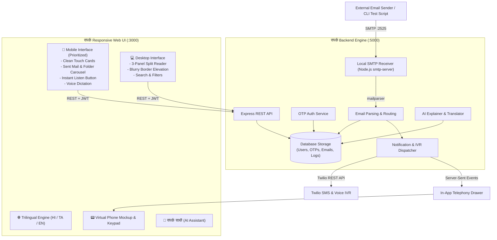

# 🌐 संपर्क (Sampark) — Universal Phone-to-Email Platform

> **"Your Digital Post — आपका डिजिटल डाकघर — உங்கள் டிஜிட்டல் அஞ்சலகம்"**  
> *Built for the **AlphaStack 7-Day Buildathon** organized by **CEDI, NIT Trichy**.*

---

## 🌟 The Problem & Social Impact

Over **600 million citizens in rural and semi-urban India** possess active mobile phone numbers, but do not own or know how to operate traditional email accounts (`username@gmail.com`). 

Yet, accessing vital government schemes (DBT, PM-Kisan, fertilizer subsidies, pension portals), banking correspondence (SBI, Gramin banks), competitive exam notices, and legal documentation strictly requires a valid email address.

**संपर्क (Sampark)** bridges this digital divide by turning every citizen's 10-digit mobile number directly into a verified, functional email address:
$$\mathbf{+91\ 98765\ 43210} \implies \mathbf{9876543210@sampark.in}$$

- **100% Passwordless**: Login using just Mobile Number + 6-digit OTP.
- **Voice OTP Verification**: Audio speaker readout for low-literacy users, SMS OTP, or automated phone call.
- **Inbound Local SMTP Server (:2525)**: Listens for real emails from external organizations, government portals, and banks.
- **Instant SMS & Voice IVR Alerts**: Automated notifications when new mail arrives.
- **Female Voice Assistant & Regional Translator**: 1-tap translation into pure Hindi/Tamil with natural voice playback.
- **Sampark Saathi AI**: Translates complex bureaucratic notices into simple, everyday village language.

---

## ✨ Key Features & Innovations

| Feature | Description |
| :--- | :--- |
| 📱 **Universal Email Mapping** | Citizen mobile numbers automatically become valid email addresses (`9876543210@sampark.in`). |
| 🔑 **3-Way Voice OTP Login** | Verify via SMS, listen aloud via female voice speaker, or receive an automated Twilio voice call. |
| 📥 **Local SMTP Server (:2525)** | Full RFC 5322 mail transfer receiver built in Node.js that parses inbound emails and routes them to user mailboxes. |
| 🤖 **संपर्क साथी (Sampark Saathi AI)** | In-app AI assistant that explains complicated legal/banking emails in simple rural language. |
| 🌐 **1-Tap Regional Translator** | Instant sentence-by-sentence translation with female voice audio synthesis. |
| 🗣️ **Trilingual Accessibility** | 100% pure **हिंदी (Hindi)**, **தமிழ் (Tamil)**, or **English** without confusing bracketed text. |
| 📤 **Complete Folder Stream** | All Mail, Unread, Sent Mail, Starred, Read, Drafts, Spam, and Trash with real-time sync. |
| 🧹 **Compose Auto-Erase Engine** | Automatic data purging upon sending and clean state reset for new messages. |
| 🌓 **Day / Night Mode** | Elevated cards with soft blurry shadow borders for maximum contrast under sunlight or nighttime reading. |
| 📟 **In-App Live Phone Simulator** | Built-in interactive virtual smartphone with real-time SSE stream for 100% foolproof hackathon judging demonstrations. |
| 🐳 **100% Dockerized** | Launch the entire multi-service stack with a single command: `docker compose up -d`. |

---

## 🏛️ System Architecture



---

## 🚀 Quickstart Guide

### Option 1: One-Click Launch via Docker Compose (Recommended)

```bash
docker compose up -d --build
```

- **Frontend Web App**: [http://localhost:3000](http://localhost:3000)
- **Backend API & SSE**: [http://localhost:5000](http://localhost:5000)
- **Local SMTP Receiver**: `localhost:2525`

To stop the containers:
```bash
docker compose down
```

---

### Option 2: Running Locally with Node.js

#### Prerequisites
- Node.js v18+ (tested on Node.js v20 LTS)
- npm v9+

#### 1. Start the Backend & SMTP Server
```bash
cd apps/backend
npm install
npm start
```
*The backend API will run on `http://localhost:5000` and the SMTP server on port `2525`.*

#### 2. Start the Frontend Web App
```bash
cd apps/frontend
npm install
npm run dev
```
*The web client will run on `http://localhost:3000` (and on your local Wi-Fi IP for real phone testing).*

---

## 🧪 3-Minute Live Hackathon Demo Walkthrough

1. **Open the Web Client**: Go to [http://localhost:3000](http://localhost:3000).
2. **Language Selection**: Toggle between **हिंदी**, **தமிழ்**, or **EN** to see the 100% single-language interface.
3. **Login Experience**:
   - Enter your 10-digit mobile number (e.g., `9236531947`).
   - Click **"ओटीपी प्राप्त करें"** (Send OTP).
   - Test **"आवाज में सुनें"** (Audio Voice OTP readout).
   - Click the fast-track demo code chip (**123456**) to log in instantly.
   - Watch the smooth post-login celebration splash screen transition directly into the mailbox.
4. **Open the Live Telephony Drawer**:
   - Click the smartphone icon in the top header.
   - The virtual phone drawer slides out, ready to receive live SMS and calls.
5. **Dispatch a Real Inbound Email via Local SMTP**:
   Open a terminal and run:
   ```powershell
   node scripts/send-test-email.js 9236531947 "Ministry of Agriculture" "PM Kisan 17th Installment Credited" "Namaste! Your Rs 2,000 installment for PM-Kisan Samman Nidhi has been released directly to your Aadhaar linked bank account."
   ```
6. **Live Telephony & Inbound Arrival**:
   - The local SMTP server intercepts the email on port `2525`.
   - An **SMS alert instantly rings** inside the live simulator drawer.
   - The new email appears in the mailbox with an unread indicator.
7. **Voice Assistant & Translator**:
   - Click **"महिला आवाज में सुनें"** to hear the email read aloud.
   - Click **"हिंदी में अनुवाद करें"** to translate the message.
   - Click **"संपर्क साथी"** to get an AI-simplified explanation.
8. **Compose & Auto-Erase**:
   - Click **"नया पत्र लिखें"** (Compose).
   - Click **"बोलकर लिखें"** (Mic) to dictate a reply using your voice.
   - Hit **"भेजें"** (Send). Notice all form fields are automatically erased for the next email.
   - Open the **"📤 भेजे गए पत्र"** (Sent Mail) folder to view the dispatched message!

---

## 🔒 Security & Privacy Features

- **Passwordless Zero-Trust**: Eliminates weak or reused passwords among first-time internet users.
- **JWT Session Security**: Time-bound cryptographic tokens for authorized mailbox access.
- **HTML Sanitization**: Prevents malicious script execution in incoming emails before rendering.
- **Verified Sender Badges**: Distinguishes authentic government (`.gov.in`) and banking sources from untrusted senders to protect rural citizens from phishing.

---

## 🏆 AlphaStack Buildathon Judging Checklist (CEDI NIT Trichy)

- [x] **Email Application**: Inbound receiving, outbound composing, reading, archiving, and deletion.
- [x] **Local SMTP Server**: Listens on port `2525` with RFC 5322 MIME parsing.
- [x] **Mobile Interface (*Prioritized*)**: Touch cards, horizontal folder stream, Sent Mail section, and zero-overflow header.
- [x] **Desktop Interface**: 3-panel widescreen layout with clear blurry border elevation in bright mode.
- [x] **Passwordless OTP Authentication**: SMS OTP, female voice speaker readout, and automated Twilio voice call.
- [x] **SMS Gateway & Telephony**: Twilio integration + in-app virtual phone simulator.
- [x] **Interactive Voice Response (IVR)**: Automated phone call alerts with keypad menu.
- [x] **Trilingual Accessibility**: English, हिंदी (Hindi), and தமிழ் (Tamil) without bracketed text.
- [x] **Voice-First Accessibility**: Native browser Text-to-Speech (TTS) & Speech-to-Text (STT).
- [x] **AI Assistant (Sampark Saathi)**: Simplifies complicated notices into village tongue.
- [x] **Containerized**: Single-command launch via `docker compose up -d`.
- [x] **Comprehensive Documentation**: Complete architecture, quickstart, and live demo script.

---

*Made with ❤️ for digital inclusion in India.*
