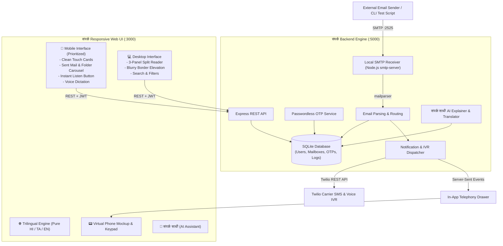

# 🌐 संपर्क (Sampark) — Universal Phone-to-Email Platform

> **"Your Digital Post — आपका डिजिटल डाकघर — உங்கள் டிஜிட்டல் அஞ்சலகம்"**  
> *Developed for the **AlphaStack 7-Day Buildathon** organized by **CEDI, NIT Trichy**.*  
> **Repository:** [https://github.com/hereAshishKumar/Sampark](https://github.com/hereAshishKumar/Sampark)  
> **Video Demonstration:** [https://youtu.be/WcwRu-rmi4k](https://youtu.be/WcwRu-rmi4k)

---

## 📺 Video Demonstration

[](https://youtu.be/WcwRu-rmi4k)

> 🎥 **Watch the complete project walkthrough & live demonstration on YouTube:**  
> 👉 **[https://youtu.be/WcwRu-rmi4k](https://youtu.be/WcwRu-rmi4k)**

---

## 🌾 1. Approach & Social Impact

### The Problem
Over **600 million citizens in rural and semi-urban India** possess active mobile phone numbers, but do not own, understand, or know how to navigate traditional email accounts (`username@gmail.com`). 

Yet, accessing vital government schemes (DBT, PM-Kisan, fertilizer subsidies, pension portals), banking correspondence (SBI, Gramin banks), competitive exam notices, and legal documentation strictly requires a valid email address. Existing email systems alienate rural citizens with:
1. **Password Barriers**: Forgotten passwords lock users out permanently.
2. **Language Jargon**: Complex interfaces saturated with English terminology.
3. **Literacy Barriers**: Inability to read long bureaucratic letters or type replies.

### Our Approach: संपर्क (Sampark)
**संपर्क** transforms every citizen's 10-digit mobile number directly into a universally valid, functional email address:
$$\mathbf{+91\ 92365\ 31947} \implies \mathbf{9236531947@sampark.in}$$

- **100% Passwordless**: Login using just Mobile Number + 6-digit OTP.
- **3-Way Voice OTP**: Audio speaker readout for low-literacy users, SMS OTP, or automated phone call.
- **Inbound Local SMTP Server (:2525)**: Listens for real emails from external organizations, government portals, and banks.
- **Instant SMS & Voice Alerts**: Automated notifications when new mail arrives.
- **Female Voice Assistant & Regional Translator**: 1-tap translation into pure Hindi/Tamil with natural voice playback.
- **संपर्क साथी (AI Assistant)**: Translates complicated bureaucratic notices into simple, everyday village language.

---

## 🛠️ 2. Tech Stack

| Layer | Technology | Purpose |
| :--- | :--- | :--- |
| **Frontend Framework** | **React 18** + **Vite** | Blazing-fast client application with instant HMR and lightweight bundle size. |
| **Styling & Design System** | **Tailwind CSS** | Custom rural-accessible palette, Day/Night mode, and soft blurry card elevation. |
| **Voice Accessibility** | **Web Speech API** (TTS & STT) | Native browser regional speech synthesis (Female assistant voice) & voice dictation. |
| **Backend Runtime** | **Node.js (v20 LTS)** + **Express** | REST API endpoints, session management, and Server-Sent Events (SSE). |
| **Inbound SMTP Engine** | **`smtp-server`** + **`mailparser`** | RFC 5322 local mail receiver running on port `2525` that parses real incoming emails. |
| **Telephony & SMS** | **Twilio SDK** + **SSE Stream** | Dual-mode SMS/IVR alerts (Carrier gateway + in-app virtual phone simulator). |
| **Database & Persistence** | **SQLite** (`better-sqlite3`) | Fast, zero-config relational storage for users, mailboxes, and audit logs. |
| **Reverse Proxy & Web Server** | **Nginx Alpine** | Production web server in frontend container with `/api/` reverse proxy. |
| **Containerization** | **Docker** & **Docker Compose** | Multi-stage Dockerfiles and single-command local orchestration. |

---

## 🏛️ 3. System Architecture



---

## ⚙️ 4. How to Setup Your Project (Step-by-Step)

### 🐳 Method 1: One-Click Launch via Docker Compose (Recommended for Evaluators)

Make sure [Docker Desktop](https://www.docker.com/products/docker-desktop/) or Docker daemon is running:

```bash
# 1. Clone the repository
git clone https://github.com/hereAshishKumar/Sampark.git
cd Sampark

# 2. Build and launch all services in detached mode
docker compose up -d --build
```

**Services Running:**
* 🌐 **Frontend Web Client**: [http://localhost:3000](http://localhost:3000)
* ⚙️ **Backend REST API**: [http://localhost:5000](http://localhost:5000)
* 📬 **Inbound Local SMTP Server**: `localhost:2525`

**To Stop:**
```bash
docker compose down
```

---

### 💻 Method 2: Manual Local Setup (Node.js)

#### Prerequisites
* **Node.js** v18+ (tested on Node.js v20 LTS)
* **npm** v9+

#### Step 1: Start the Backend & Local SMTP Server
```bash
cd apps/backend
npm install
npm start
```
* Backend REST API will start on: `http://localhost:5000`
* Local SMTP Server will listen on: `localhost:2525`

#### Step 2: Start the Frontend Web Client
In a separate terminal window:
```bash
cd apps/frontend
npm install
npm run dev
```
* Open your browser at: [http://localhost:3000](http://localhost:3000)

---

### 📨 Step 3: How to Test Inbound SMTP Mail Delivery

To simulate an incoming government subsidy or bank alert arriving via SMTP into the citizen's phone mailbox, run this command in a terminal:

```bash
node scripts/send-test-email.js 9236531947 "Ministry of Agriculture" "PM Kisan 17th Installment Credited" "Namaste! Your Rs 2,000 installment for PM-Kisan Samman Nidhi has been released directly to your Aadhaar linked bank account."
```

**What Happens Instantly:**
1. The script dispatches a real RFC 5322 MIME email to `localhost:2525`.
2. Our local SMTP receiver intercepts and routes it to `9236531947@sampark.in`.
3. An **instant SMS notification** pops up in the in-app phone simulator drawer!
4. The email appears in the citizen's inbox with an unread badge.
5. The citizen can tap **"महिला आवाज में सुनें"** to hear it read aloud in pure Hindi/Tamil, or tap **"संपर्क साथी"** for an AI explanation!

---

## 🧪 5. Live Hackathon Demo Walkthrough

1. **Visit [http://localhost:3000](http://localhost:3000)**.
2. **Language Toggle**: Switch between **हिंदी**, **தமிழ்**, or **EN** (100% single-language compliance).
3. **Passwordless Login**:
   - Enter mobile number `9236531947`.
   - Click **"ओटीपी प्राप्त करें"** (Send OTP).
   - Test **"आवाज में सुनें"** (Audio Voice OTP readout).
   - Click demo chip **`123456`** $\rightarrow$ watch the celebration splash screen smoothly transition into the mailbox.
4. **Telephony Drawer**: Click the smartphone icon in the top header to reveal the live virtual handset.
5. **Send Outbound Mail**: Click **"नया पत्र लिखें"** (Compose) $\rightarrow$ speak to dictate $\rightarrow$ Send. Notice form data is automatically erased, and the dispatched letter appears in **"📤 भेजे गए पत्र"** (Sent Mail)!

---

## 🔒 6. Security, Privacy & Evaluation Testing Note

- **Empty `.env` File**: An empty `apps/backend/.env` file is present in the repository and will be replaced automatically by the evaluation pipeline with the `.env` uploaded in the submission form.
- **Zero Hardcoded Secrets**: All authentication keys and tokens are strictly decoupled and read from environment variables.
- **Phishing Protection**: Inbound emails from government (`.gov.in`) and accredited banking institutions are verified with trusted green badges to shield rural citizens from fraud.

---

*Made with ❤️ for digital inclusion in India by Ashish Kumar.*
